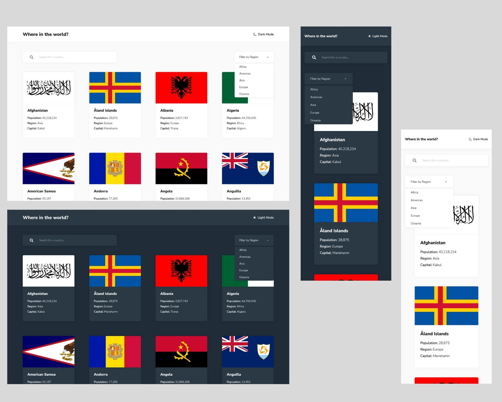
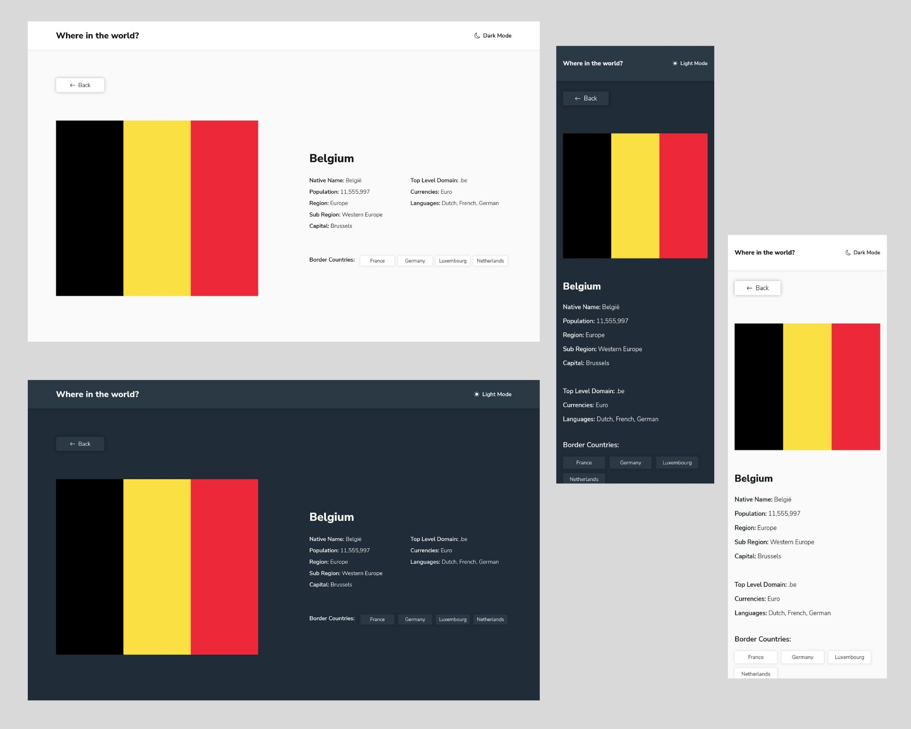

In addition to solve the challenge proposed by Frontend Mentor, my goal was to apply some professionnal methods: feature-based architecture, continuous integration and deployment, testing, pull requests.

As I wanted to play with API, I chose to make multiple API calls when it would have been more efficient to make just one call to fetch all countries then work on this data set.

# Frontend Mentor - REST Countries API with color theme switcher solution

This is a solution to the [REST Countries API with color theme switcher challenge on Frontend Mentor](https://www.frontendmentor.io/challenges/rest-countries-api-with-color-theme-switcher-5cacc469fec04111f7b848ca). Frontend Mentor challenges help you improve your coding skills by building realistic projects.

## Table of contents

- [Overview](#overview)
  - [The challenge](#the-challenge)
  - [Screenshot](#screenshot)
  - [Links](#links)
- [My process](#my-process)
  - [Built with](#built-with)
  - [What I learned](#what-i-learned)
  - [Continued development](#continued-development)
  - [Useful resources](#useful-resources)
- [Author](#author)

## Overview

### The challenge

Users should be able to:

- See all countries from the API on the homepage
- Search for a country using an `input` field
- Filter countries by region
- Click on a country to see more detailed information on a separate page
- Click through to the border countries on the detail page
- Toggle the color scheme between light and dark mode _(optional)_

### Screenshot

### Links

- Solution URL: [https://github.com/nadlgit/fmchallenge-rest-countries-api](https://github.com/nadlgit/fmchallenge-rest-countries-api)
- Live Site URL: [https://nadlgit.github.io/fmchallenge-rest-countries-api](https://nadlgit.github.io/fmchallenge-rest-countries-api)

## My process

### Built with

- [React](https://reactjs.org/), bootstrapped with [Create React App](https://github.com/facebook/create-react-app)
- [React Router](https://reactrouter.com/)
- Responsive, mobile-first workflow
- CSS Grid
- Flexbox
- CSS custom properties
- [CSS modules](https://github.com/css-modules/css-modules)
- [Mock Service Worker](https://mswjs.io/) for testing

### What I learned

As expected, I practiced with REST API and asynchronous code.

This time again I also learned a lot in CSS.

On HTML side, it was my first time building a custom select menu and I tried to fulfill accessibility requirements.

### Continued development

I plan to continue my learning of [React](https://reactjs.org/) by building projects with [NextJS](https://nextjs.org/) framework.

### Useful resources

- [React-router URLs don't work when refreshing or writing manually](https://stackoverflow.com/questions/27928372/react-router-urls-dont-work-when-refreshing-or-writing-manually) - This thread helped me to understand my options for routing in single page applications.

## Author

- Frontend Mentor - [@nadlgit](https://www.frontendmentor.io/profile/nadlgit)
